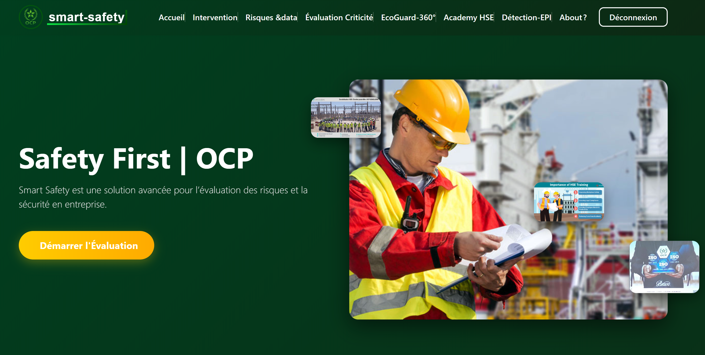
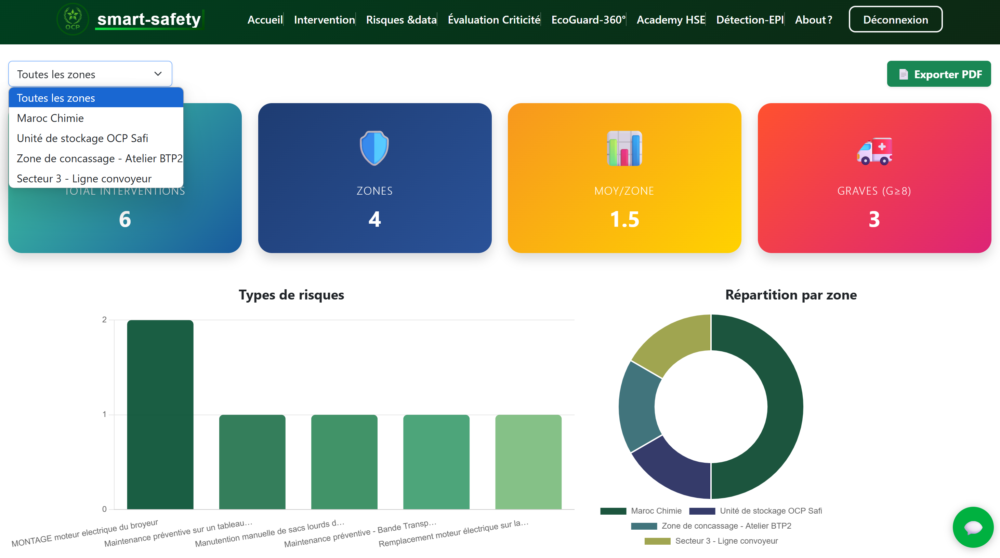
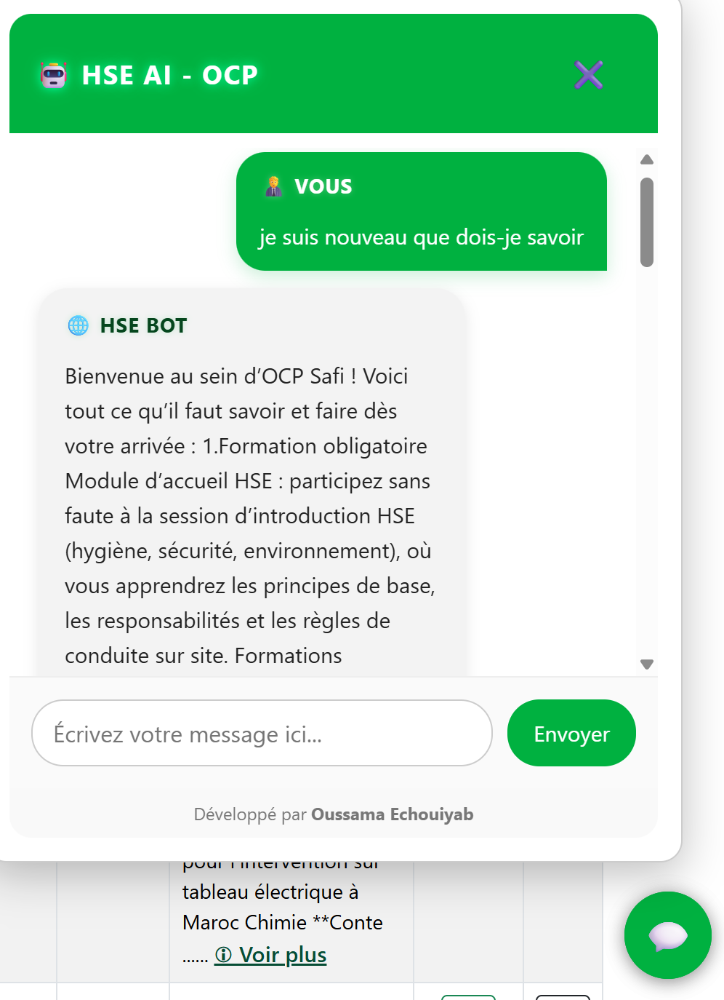
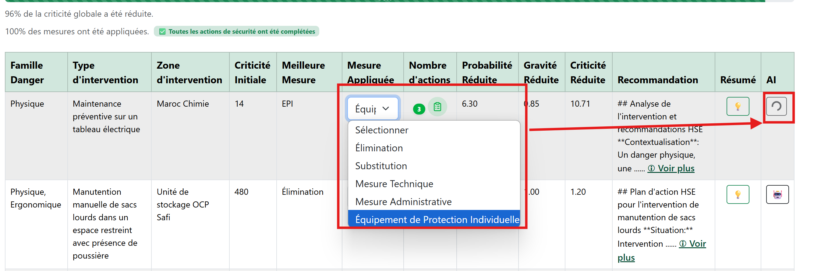

# Smart-Safety – Industrial Risk Anticipation Platform 🧠⚙️

Smart-Safety est une plateforme intelligente conçue pour **prédire les risques HSE industriels** et **aider les techniciens** sur le terrain via un chatbot local basé sur une architecture RAG (Ollama + GPT).

## 📸 Aperçu du projet






## 🧩 Stack technique

- **Frontend** : ReactJS
- **Backend** : Node.js + Express + MongoDB
- **IA** : GPT (via Ollama), PDF Summarizer, RAG local
- **Fonctionnalités** :
  - Prédiction de risques industriels
  - Génération automatique de rapports PDF
  - Chatbot intelligent offline
  - Architecture RAG embarquée pour rapidité et sécurité

## 🚀 Démarrer le projet

```bash
cd frontend && npm install && npm start
cd backend && npm install && npm run dev
